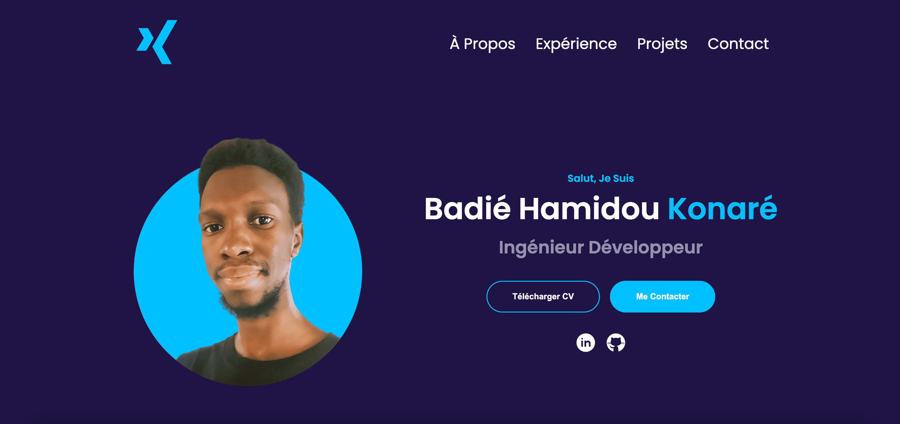
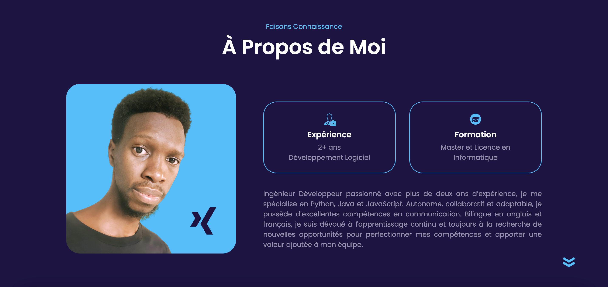
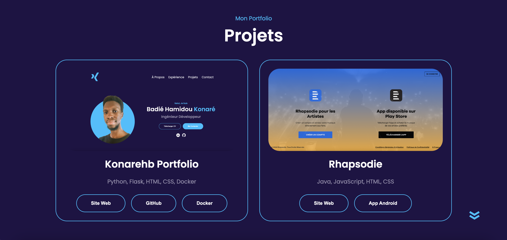

# Portfolio Flask

Bienvenue sur mon portfolio personnel développé avec Flask! 🌟

## Fonctionnalités

ℹ️ Ce portfolio présente mes compétences et projets à travers une interface web simple et élégante. Voici quelques fonctionnalités principales :

- 🖥️ Présentation de mes projets et expériences
- 📄 Détails sur mes compétences techniques

## Technologies Utilisées

🛠️ Ce projet utilise les technologies suivantes :

- Python
- Flask
- HTML5
- CSS3
- Docker

## Liens du Projet

Voici les liens du projet :

- 🌐 **Site Live**: [Mon Portfolio Live](https://konarehb.vercel.app/)
- 📦 **GitHub**: [Repository GitHub](https://github.com/konarehb/flask-portfolio)
- 🐳 **Docker**: [Docker Hub](https://hub.docker.com/r/konarehb/flask-portfolio)

## Comment Déployer Localement 🚀

Pour déployer localement ce projet, suivez ces étapes :

1. Clonez ce repository.
2. Installez les dépendances avec `pip3 install -r requirements.txt`.
3. Lancez l'application avec `python3 app.py`.
4. Ouvrez votre navigateur et accédez à `http://localhost:5500`.

## Comment Déployer avec Docker 🐳

Pour déployer ce projet en utilisant Docker, suivez ces étapes :

1. Assurez-vous d'avoir Docker installé sur votre machine.
2. Clonez ce repository.
3. À la racine du projet, construisez l'image Docker en utilisant la commande suivante : `docker build -t nom_image`. Remplacez `nom_image` par le nom que vous souhaitez donner à votre image Docker.
4. Lancez un conteneur Docker à partir de l'image construite : `docker run -p 5500:5500 nom_image`. Cela expose le port 5500 de votre conteneur Docker sur votre machine locale.
5. Ouvrez votre navigateur et accédez à `http://localhost:5500` pour voir l'application Flask en cours d'exécution.

## Captures d'écran

📸 Voici quelques captures d'écran du portfolio :

## Contribuer

Toute contribution est la bienvenue! Si vous avez des suggestions ou des améliorations à apporter, n'hésitez pas à ouvrir une issue ou à proposer une pull request.

## Contact

Pour toute question ou commentaire, vous pouvez me contacter à l'adresse suivante : (konarehb@gmail.com).

Merci d'avoir visité mon portfolio! 😊